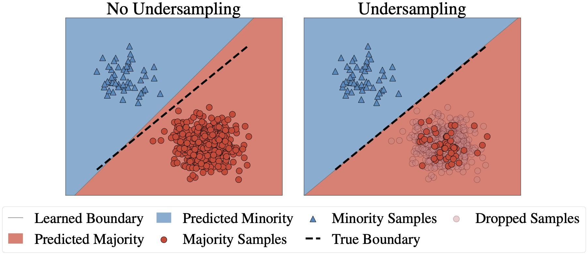

# Undersampling is a Minimax Optimal Robustness Intervention in Nonparametric Classification


```
@article{chatterji2022undersampling,
  title={Undersampling is a Minimax Optimal Robustness Intervention in Nonparametric Classification},
  author={Chatterji, Niladri S and Haque, Saminul and Hashimoto, Tatsunori},
  journal={arXiv preprint arXiv:2205.13094},
  year={2022}
}
```

- [Code](https://github.com/niladri-chatterji/undersampling-minimax)
- [arXiv](https://arxiv.org/abs/2205.13094)

This repo is created by from the repository [importance-weighting-interpolating-classifiers](https://github.com/KeAWang/importance-weighting-interpolating-classifiers). It uses the template from [lightning-hydra-template](https://github.com/ashleve/lightning-hydra-template).
Experiment settings are managed by [hydra](https://hydra.cc/), a hierarchical config framework, and the setting files are specified in the `configs/` directory.

## Setup instructions

0. Make a weights and bias account
1. `conda env create -f conda_env.yml`
2. `pip install requirements.txt`
3. Copy `.env.tmp` to a new file called `.env`. Edit the `PERSONAL_DIR` environment variable in `.env` to be the root directory of where you want to store your data.

## Reproducing experiments

The commandline scripts below will run with the default seed. In our paper we loop over seeds for each experiment, which you can do by appending `seed=0,1,2,3,4` to the launch script below.

Some seeds may result in NaNs during training. Relaunching the experiments (without changing the seed) will get rid of the NaNs, likely due to GPU non-determinism.

### Figure 1

Run `notebooks/two-gaussians.ipynb`

### Figure 2 (Importance Weighted Cross-Entropy Loss and VS Loss)

```bash
# Imbalanced Binary CIFAR10
python run.py +experiment=cifar_erm loss_fn=cross_entropy trainer.max_epochs=400
python run.py +experiment=cifar_reweighted loss_fn=cross_entropy trainer.max_epochs=400
python run.py +experiment=cifar_reweighted loss_fn=cross_entropy trainer.max_epochs=400 datamodule.train_weight_exponent=1.5 optimizer.momentum=0. optimizer.lr=0.008 

python run.py +experiment=cifar_erm loss_fn=polynomial_loss trainer.max_epochs=400
python run.py +experiment=cifar_reweighted loss_fn=polynomial_loss trainer.max_epochs=400
python run.py +experiment=cifar_reweighted loss_fn=polynomial_loss trainer.max_epochs=400 datamodule.train_weight_exponent=1.5 optimizer.momentum=0. optimizer.lr=0.008 

# Subsampled CelebA
python run.py +experiment=celeba_erm loss_fn=cross_entropy 
python run.py +experiment=celeba_reweighted loss_fn=cross_entropy 
python run.py +experiment=celeba_reweighted loss_fn=cross_entropy datamodule.train_weight_exponent=2.0 trainer.max_epochs=100

python run.py +experiment=celeba_erm loss_fn=polynomial_loss
python run.py +experiment=celeba_reweighted loss_fn=polynomial_loss
python run.py +experiment=celeba_reweighted loss_fn=polynomial_loss datamodule.train_weight_exponent=2.0 trainer.max_epochs=100
```

### Figure 3 (Hat Function)

Run `notebooks/two-gaussians.ipynb`


### Figure 4 (Tilted loss and Group DRO)

```bash
# Imbalanced Binary CIFAR10

python run.py +experiment=cifar_reweighted loss_fn=cross_entropy trainer.max_epochs=400
python run.py +experiment=cifar_reweighted_early_stopped loss_fn=cross_entropy trainer.max_epochs=400
python run.py +experiment=cifar_reweighted_early_stopped loss_fn=cross_entropy trainer.max_epochs=400 datamodule.train_weight_exponent=1.5 optimizer.momentum=0. optimizer.lr=0.008 


python run.py +experiment=cifar_reweighted loss_fn=polynomial_loss trainer.max_epochs=400
python run.py +experiment=cifar_reweighted_early_stopped loss_fn=polynomial_loss trainer.max_epochs=400
python run.py +experiment=cifar_reweighted_early_stopped loss_fn=polynomial_loss trainer.max_epochs=400 datamodule.train_weight_exponent=1.5 optimizer.momentum=0. optimizer.lr=0.008 

# Subsampled CelebA
python run.py +experiment=celeba_reweighted loss_fn=cross_entropy 
python run.py +experiment=celeba_reweighted_early_stopped loss_fn=cross_entropy
python run.py +experiment=celeba_reweighted_early_stopped loss_fn=cross_entropy datamodule.train_weight_exponent=2.0 trainer.max_epochs=100

python run.py +experiment=celeba_reweighted loss_fn=polynomial_loss
python run.py +experiment=celeba_reweighted_early_stopped loss_fn=polynomial_loss
python run.py +experiment=celeba_reweighted_early_stopped loss_fn=polynomial_loss datamodule.train_weight_exponent=2.0 trainer.max_epochs=100

```
